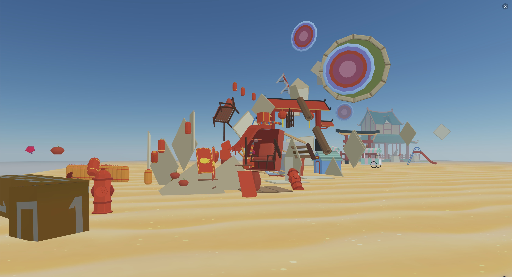
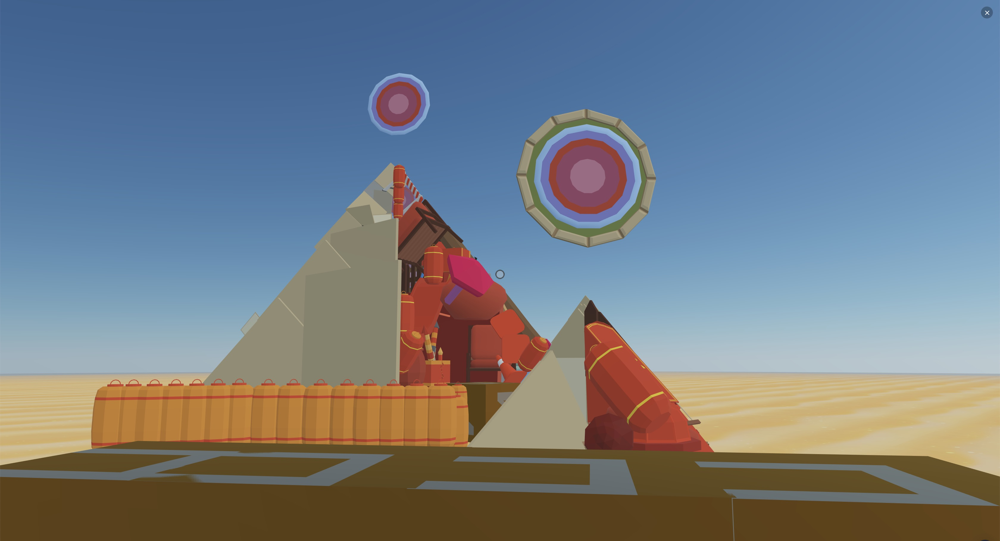

Decentraland-builder-competition submission
## Hidden Perspectives

The metaverse can change perspectives.
There is one specific place in the scene that will allow you so see the a surprise.

## What is it
this project doesn't have a script that generates the content. The `HiddenPerspective.js` file only contains some functions to quickly change point of view in the editor, especially needed to go back and forth between the perspective point and another 3D view so that you can easily manipulate the content.

The camera controls both in the editor and in preview mode are very basic and have some inconsistencies (especially in the Zoom level)

## How to use it

- open the browser on https://builder.decentraland.org
- open any project
- copy & paste the content of the `HiddenPerspective.js` in the browser console

now you have some useful functions to quickly switch point of view
